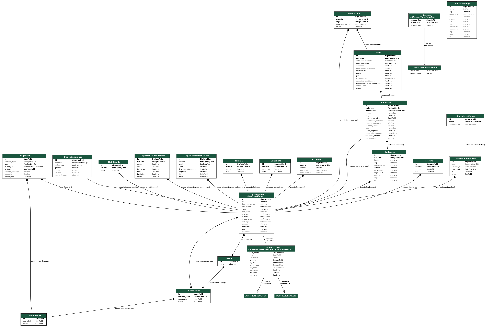
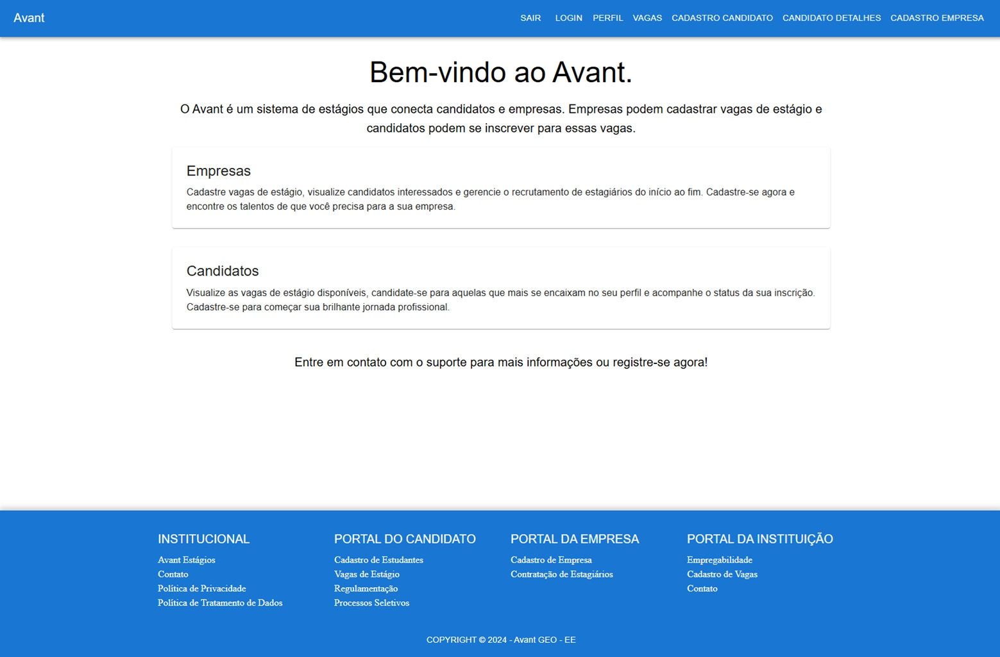
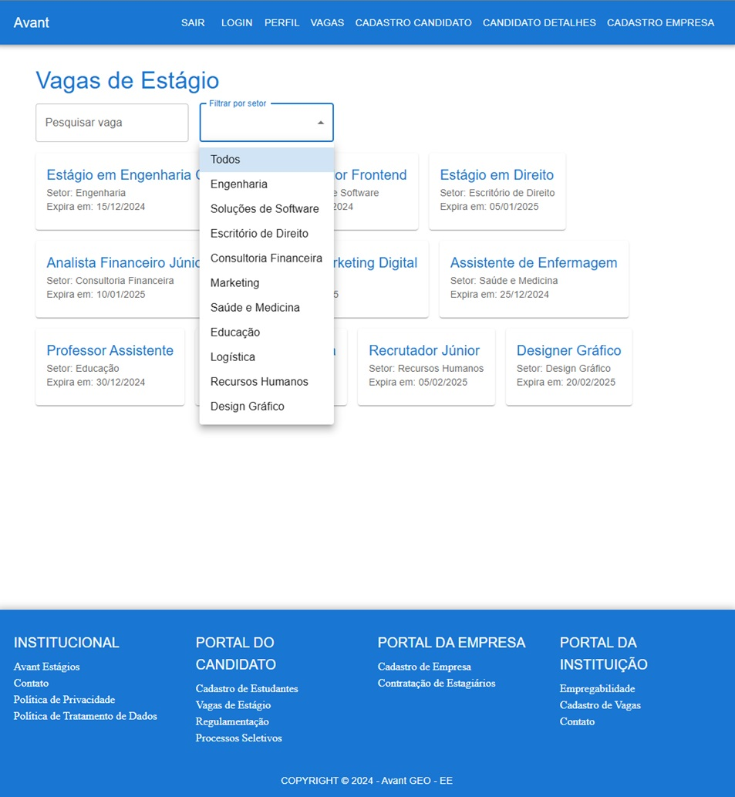
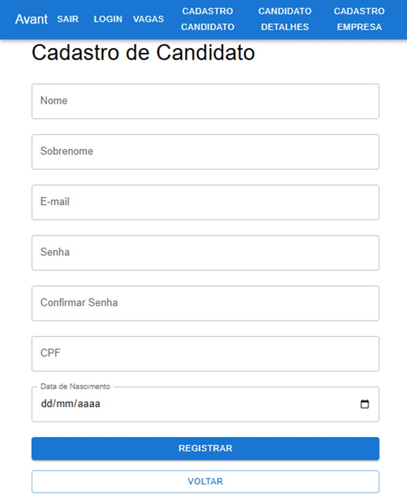
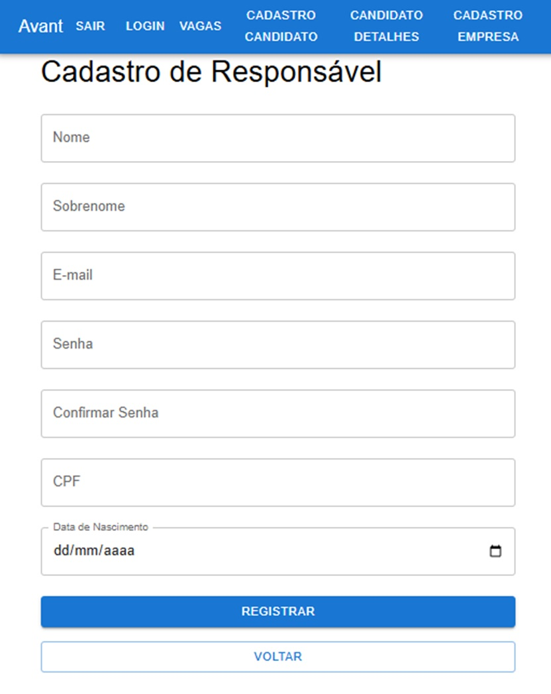
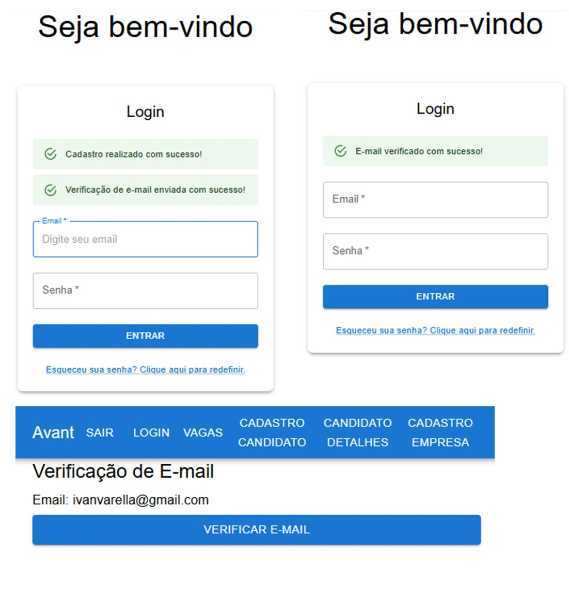
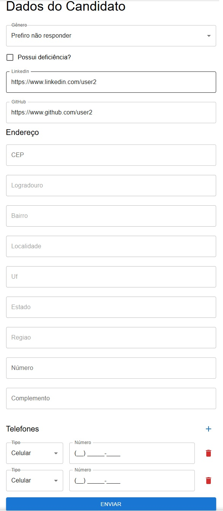
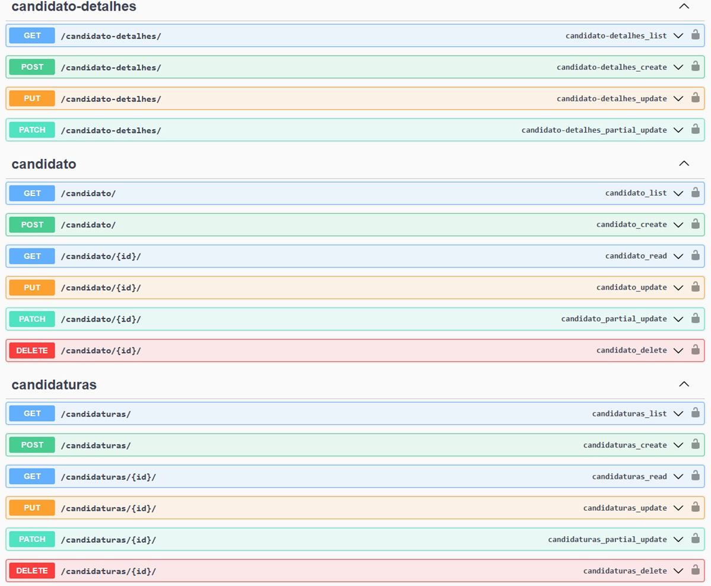
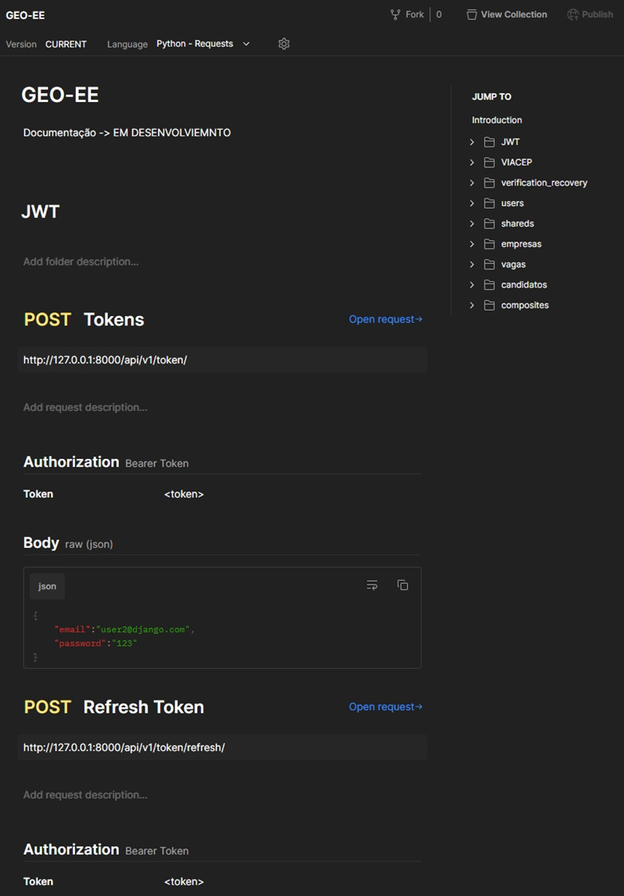

<div align="center" style="padding-top: 20px;">

[](https://fap.softexrecife.org.br/)

# Projeto Integrador - Formação Acelerada em Pogramação (FAP)

</div>

## Este projeto implementa um Sistema de Gerenciamento de Oportunidades de Estágios e Bolsas para Engenharia (GEO-Eng) foi concebido para centralizar, divulgar e gerenciar oportunidades de estágios e bolsas para alunos dos cursos de Engenharia da UFRN. Ele servirá como um ponto de conexão entre empresas, universidade e alunos, permitindo a busca eficiente de vagas e facilitando a comunicação entre as partes interessadas.

### Este projeto faz parte do curso FAP promovido por: </br>

- Softex </br>
- Ministério da Ciência, Tecnologia e Inovação </br>
- Universidade Federal do Rio Grande do Norte </br>

### Descrição do curso

O curso FAP possui uma carga horária de 200 horas e abrange as seguintes áreas de conhecimento e tecnologias:

- Back-End com Python
- Lógica de Programação com Python
- Python e Orientação a Objetos
- Padrões de Desenvolvimento de Software
- Introdução a Web Services
- Noções de Banco de Dados
- Django

## Índice

- [Funcionalidades](#funcionalidades)
- [Tecnologias Utilizadas](#tecnologias-utilizadas)
- [Como Executar o Projeto (backend com Django)](#como-executar-o-projeto)
- [Estrutura do Projeto - Repositório](#estrutura-do-projeto-repositório)
- [Estrutura do Projeto - Backend](#estrutura-do-projeto-backend)
- [Como executar o projeto - Backend](#como-executar-o-projeto)
- [Executando com SQLite](#para-sqlite)
- [Executando com Postgres](#para-postgres)
- [Postman](#postman)
- [Observações](#observações)
- [Dependências Backend](#dependências-backend)
- [Estrutura do Repositório Backend](#estrutura-do-repositório-backend)
- [Diagrama ERD](#diagrama-erd)
- [Como Executar o Projeto (Frontend com React - Vite)](#como-executar-o-projeto-frontend)
- [Estrutura do Repositório Frontend](#front-end-com-react)
- [Dependências Dependências Frontend](#dependências-frontend)
- [Telas de exemplo do projeto](#telas-de-exemplo-do-projeto)

## Funcionalidades

    (concluídas e em desenvolvimento)

- **Registro de candidatos edição de perfil e currículo**
- **Registro de empresas edição de perfil**
- **Cadastro de oportunidades (vagas de estágio e bolsas)**
- **Candidaturas dos estudantes à vagas diponíveis**
- **Busca de vagas e filtragem por critérios variados**
- **Verificação e confirmação de emails cadastrados**
- **Recuperação de senhas de contas de usuários**
- **Gerenciamento de autenticação de usuário (Django DRF com Simple JWT)**
- **Gerenciamento de permissões de acesso em cada endpoint disponível**

## Tecnologias Utilizadas

-   
  **Python** é a linguagem de programação principal utilizada no projeto, versão 3.x.
-   
  **Django** é o framework web utilizado para construir o back-end do projeto, versão 5.x.
-   
  **Django Rest Framework** é utilizado para construir a API RESTful, versão 3.x.
-   
  **JWT (JSON Web Tokens)** é usado para autenticação segura e gerenciar sessões de usuários, utilizando a biblioteca `simple JWT`.
-   
  **RQL (Resource Query Language)** é a linguagem de consulta utilizada para acessar os recursos na API.
-   
  **SQLite** é o banco de dados utilizado para desenvolvimento e testes, versão 3.x.
-   
  **Postgres** é o banco de dados de produção utilizado, versão 16.x.
-   
  **Postman** é a ferramenta utilizada para testar as APIs, versão 11.x.
-   
  **Swagger** é utilizado para gerar a documentação interativa da API com base nos endpoints.
-   
  **React** é a biblioteca JavaScript utilizada para o desenvolvimento da interface de usuário, versão 18.x.
-   
  **Vite** é a ferramenta de build e desenvolvimento rápida para o front-end, versão 4.x.
-   
  **JavaScript** é a linguagem utilizada no front-end, com suporte para recursos modernos da versão ES6.
-   
  **MUI (Material UI)** é a biblioteca de componentes de interface de usuário baseada no Material Design, versão 5.x.
-   
  **Git** é o sistema de controle de versão utilizado no projeto.
-   
  **GitLab** é a plataforma de gerenciamento de repositórios Git e integração contínua utilizada para o código-fonte do projeto.

## Como Executar o Projeto

1. **Clone o Repositório (Backand + Frontend)**
   HTTPS:

   ```bash
   git clone https://github.com/ivanvarella/geo_ee_avant.git
   ```

   OU

   SSH:

   ```bash
   git clone git@github.com:ivanvarella/geo_ee_avant.git
   ```

   ## Após o repositório ser clonado, você encontrará esta estrutura de arquivos:

   ## Estrutura do Projeto Repositório

   ```text
     .
     geo_ee_avant/
     ├── backend/    # Contém o repositório backend
     ├── frontend/   # Contém o repositório frontend
     └── README.md   # Readme do projeto
   ```

   ## Estrutura do Projeto Backend

   ```text
    .
    ├── README.md
    ├── candidatos
    ├── composites
    │   └── candidato_detalhes
    ├── core
    ├── documentation
    ├── empresas
    ├── media
    │   ├── curriculos
    │   ├── empresas_banners
    │   └── empresas_logos
    ├── requirements.txt
    ├── shareds
    ├── users
    ├── vagas
    └── verification_recovery
   ```

2. **Navegue até a pasta raiz do projeto Django**

   ```bash
   cd geo_ee_avant/backend
   ```

3. **Crie e ative um Ambiente Virtual e o ative**

   ```bash
   python3 -m venv .venv
   source env/bin/activate
   ```

4. **Instale as Dependências**

   ```bash
   pip install -r requirements.txt
   ```

5. **Renomeie o arquivo .env.exemple para .env e preencha o conteúdo conforme necessário**

   #### Obs: Se você quiser usar SQLite como Banco de Dados, apenas ignore a configuração DATABASE no arquivo .env, caso contrário, insira a configuração do Postgres na parte DATABASE.

   ##### Estrutura do arquivo .env.exemple:

   ```text
   # GENERALS
   SECRET_KEY="Put yours Django SECRET_KEY here"
   DEBUG="True"

   # JWT
   ROTATE_REFRESH_TOKENS="True"
   BLACKLIST_AFTER_ROTATION="True"
   ACCESS_TOKEN_LIFETIME="15"
   REFRESH_TOKEN_LIFETIME="1"

   # DATABASE (local: postgres, production: postgres)
   DATABASE_NAME="postgres"
   DATABASE_USER="user"
   DATABASE_PASSWORD="user password"
   DATABASE_HOST="address"
   DATABASE_PORT="5432"

   # Configuration to password recover sending email
   EMAIL_BACKEND="django.core.mail.backends.smtp.EmailBackend"
   EMAIL_HOST="SMTP server"
   EMAIL_PORT=Port
   EMAIL_USE_TLS=True
   EMAIL_HOST_USER="email address"
   EMAIL_HOST_PASSWORD="email password"
   # Configuration to email verificattion
   DEFAULT_FROM_EMAIL = "email address"
   FRONTEND_URL = "Frontend URL"
   ```

6. **Configure o JWT conforme necessário no arquivo .env**

7. **Gere uma nova Django SECRET_KEY e copie-a no arquivo .env (passo 5)**

   ```bash
   python3 -c "from django.core.management.utils import get_random_secret_key; print(get_random_secret_key())"
   ```

## Para SQLite

8. **Configure o Arquivo settings.py**

#### No arquivo settings.py (core/settings.py), apenas remova os comentários para esta configuração (caso esteja comentádo) de DATABASE:

```python
DATABASES = {
    "default": {
        "ENGINE": "django.db.backends.sqlite3",
        "NAME": BASE_DIR / "db.sqlite3",
        "TEST": {
            "NAME": BASE_DIR / "test_db.sqlite3",
            "MIRROR": None,
        },
    }
}
```

## Para Postgres

8. **Configure o Arquivo settings.py**

#### No arquivo settings.py (core/settings.py), apenas remova os comentários para esta configuração (caso esteja comentádo) de DATABASE:

```python
DATABASES = {
    "default": {
        "ENGINE": "django.db.backends.postgresql",
        "NAME": env("DATABASE_NAME"),
        "USER": env("DATABASE_USER"),
        "PASSWORD": env("DATABASE_PASSWORD"),
        "HOST": env("DATABASE_HOST"),
        "PORT": env("DATABASE_PORT"),
    }
}
```

Obs: Neste passo, você já deve ter configurado o .env com a configuração de conexão do seu banco de dados Postgres.

9. **Crie as Tabelas do Banco de Dados**

```bash
python3 manage.py makemigrations
python3 manage.py migrate
```

10. **Crie um Superusuário no Django**

```bash
python3 manage.py createsuperuser
```

#### Siga as instruções no terminal para configurar o superusuário:

```bash
Username (leave blank to use 'admin'): admin
Email address: admin@example.com
Password: ********
Password (again): ********
```

11. **Inicie o Servidor**

```bash
python3 manage.py runserver
```

12. **Acesse a Aplicação**

### Após iniciar o servidor, você pode acessar a aplicação através de um navegador web:

#### Interface Web: Abra seu navegador e acesse http://127.0.0.1:8000/ para acessar a interface principal da aplicação. Mas por se tratar de uma aplicação RESTFul backend, não terá muito o que se ver aqui.

#### Interface Admin: Para gerenciar usuários e outros dados apensar considerando o backend, acesse o painel admin do Django navegando para http://127.0.0.1:8000/admin/. Use as credenciais de superusuário que você criou anteriormente para fazer login. Lá você terá acesso a alguns dados do sistema.

## Postman

### Testando a API

#### Para explorar e testar os endpoints da API, você pode importar o arquivo da coleção Postman ou acessar a documentação online disponível para este projeto.

- **Importar Coleção**: No diretório `documentation` é possível encontrar o arquivo [GEO-EE.postman_collection.json](documentation/GEO-EE.postman_collection.json) que pode ser importado utilizando o aplicativo do Postman para acessar os principais endpoints.
- **Documentação API Postman**: [Acesse a documentação da API](https://fap-geo-ee.postman.co/workspace/FAP---GEO-EE-Workspace~c5965bf1-9632-45c6-8dbc-901cbc498f89/collection/38074810-f7bd771b-c632-4c8c-aaf8-f32a214ca7e8?action=share&creator=38074810).

## Observações

- Este projeto é um exemplo simples para fins educacionais.
- É importante implementar medidas de segurança adicionais para proteger os dados dos usuários em um ambiente real.
- Adapte o projeto de acordo com suas necessidades e requisitos.

## Dependências Backend

- `asgiref==3.8.1`: Framework ASGI para Django.
- `cachetools==5.5.0`: Ferramenta Google Code-in para cache.
- `Django==5.1.2`: Framework de desenvolvimento web Django.
- `django-cors-headers==4.5.0`: App Django para manipulação de CORS.
- `django-environ==0.11.2`: Gerenciamento de variáveis de ambiente Django.
- `django-extensions==3.2.3`: Extensões adicionais para Django.
- `django-rql==4.4.1`: Integração Django com Resource Query Language.
- `djangorestframework==3.15.2`: Kit de ferramentas para construir APIs Web em Django.
- `djangorestframework-simplejwt==5.3.1`: Autenticação Simple JSON Web Token para Django REST framework.
- `drf-yasg==1.21.8`: Gerador de documentação Swagger para Django REST framework.
- `inflection==0.5.1`: Ferramentas para manipulação de palavras e pluralização.
- `lark-parser==0.11.0`: Biblioteca de análise para Python.
- `lib-rql==2.0.2`: Biblioteca para Resource Query Language.
- `packaging==24.2`: Ferramenta para manipulação de pacotes e versões.
- `pillow==11.0.0`: Fork da Python Imaging Library (PIL).
- `pydotplus==2.0.2`: Biblioteca para geração de gráficos DOT.
- `PyJWT==2.9.0`: Implementação JSON Web Token em Python.
- `pyparsing==3.2.0`: Biblioteca de parsing para Python.
- `python-dateutil==2.9.0.post0`: Extensões poderosas para o módulo datetime padrão do Python.
- `pytz==2024.2`: Biblioteca para manipulação de fusos horários.
- `PyYAML==6.0.2`: Biblioteca para manipulação de arquivos YAML.
- `six==1.16.0`: Biblioteca de compatibilidade Python 2 e 3.
- `sqlparse==0.5.1`: Ferramenta de formatação e análise SQL.
- `typing_extensions==4.12.2`: Extensões para o módulo typing.
- `uritemplate==4.1.1`: Ferramenta para trabalhar com templates de URI.

## Estrutura do Repositório Backend

```plaintext
.
├── README.md                           # Arquivo de documentação geral, contém informações sobre o projeto, como requisitos, instalação, configuração e uso.
├── candidatos                          # Aplicação para gerenciar dados e funcionalidades relacionadas aos candidatos.
│   ├── admin.py                        # Configurações do painel administrativo para o modelo de candidatos.
│   ├── apps.py                         # Arquivo de configuração da aplicação, necessário para que o Django reconheça este diretório como uma aplicação.
│   ├── filters.py                      # Contém filtros personalizados para consultar candidatos no banco de dados.
│   ├── models.py                       # Define os modelos de dados relacionados aos candidatos, como atributos e relações com outras entidades.
│   ├── permissions.py                  # Define permissões para acessar ou modificar os dados dos candidatos.
│   ├── serializers.py                  # Define como os dados dos candidatos são convertidos para formatos como JSON, usado nas APIs.
│   ├── test_views.py                   # Testes específicos para as views que tratam os candidatos.
│   ├── tests.py                        # Testes gerais para as funcionalidades relacionadas aos candidatos.
│   ├── urls.py                         # Roteamento de URLs específicos para as views relacionadas aos candidatos.
│   └── views.py                        # Define as views (funções ou classes) que tratam as requisições HTTP e a lógica para candidatos.
├── composites                          # Diretório para aplicação composites, trata de funcionalidades que envolvem múltiplos modelos ou lógicas de negócios.
│   ├── candidato_detalhes              # Subaplicação para gerenciar os detalhes dos candidatos.
│   │   ├── admin.py                    # Configuração de administração para detalhes de candidatos.
│   │   ├── permissions.py              # Permissões para ações específicas nos detalhes dos candidatos.
│   │   ├── serializers.py              # Serializadores para exibir os detalhes dos candidatos na API.
│   │   ├── tests.py                    # Testes específicos para as funcionalidades de detalhes dos candidatos.
│   │   └── views.py                    # Views que gerenciam a exibição e manipulação dos detalhes dos candidatos.
│   └── urls.py                         # Roteamento de URLs para as views do diretório para so Endpoints gerados pela aplicação composites.
├── core                                # Arquivo de configuração central do projeto.
│   ├── asgi.py                         # Arquivo de configuração para suporte assíncrono (geralmente utilizado em conexões WebSocket ou outras operações assíncronas).
│   ├── settings.py                     # Arquivo principal de configurações, incluindo banco de dados, aplicativos instalados, e configurações gerais do projeto.
│   ├── urls.py                         # Roteamento principal de URLs para o projeto Django.
│   └── wsgi.py                         # Arquivo de configuração para implantação via WSGI (servidores como Gunicorn).
├── documentation                       # Diretório para documentos adicionais do projeto, como testes de API ou modelos de dados.
│   ├── GEO-EE.postman_collection.json  # Coleção Postman com testes para as APIs do projeto.
│   └── models.py                       # Modelos de dados utilizados para as funcionalidades documentadas.
├── empresas                            # Aplicação para gerenciar dados e funcionalidades relacionadas às empresas.
│   ├── admin.py                        # Configurações do painel administrativo para o modelo de empresas.
│   ├── apps.py                         # Arquivo de configuração da aplicação.
│   ├── filters.py                      # Filtros personalizados para consultar empresas no banco de dados.
│   ├── models.py                       # Define os modelos de dados relacionados às empresas.
│   ├── permissions.py                  # Define permissões para acessar ou modificar os dados das empresas.
│   ├── serializers.py                  # Serializadores para a conversão de dados das empresas para formatos como JSON.
│   ├── tests.py                        # Testes gerais para as funcionalidades da aplicação de empresas.
│   ├── urls.py                         # Roteamento de URLs para as views relacionadas às empresas.
│   └── views.py                        # Views para manipulação das requisições HTTP relacionadas às empresas.
├── manage.py                           # Script de gerenciamento do Django, usado para executar comandos administrativos como migrações e inicialização do servidor.
├── media                               # Diretório para arquivos de mídia carregados pelos usuários ou sistema.
│   ├── curriculos                      # Pasta para armazenar currículos enviados pelos candidatos.
│   ├── empresas_banners                # Pasta para banners das empresas.
│   └── empresas_logos                  # Pasta para logos das empresas.
├── requirements.txt                    # Arquivo contendo as dependências do projeto, necessário para instalação do ambiente virtual.
├── shareds                             # Aplicação para funcionalidades e dados compartilhadas entre diferentes entidades do sistema. Endereços e Telefones.
│   ├── admin.py                        # Configuração de administração para dados da aplicação.
│   ├── apps.py                         # Arquivo de configuração da aplicação.
│   ├── filters.py                      # Filtros personalizados para dados da aplicação.
│   ├── models.py                       # Modelos para dados da aplicação.
│   ├── permissions.py                  # Permissões para acessar ou modificar dados da aplicação.
│   ├── serializers.py                  # Serializadores para dados da aplicação.
│   ├── tests.py                        # Testes gerais para as funcionalidades da aplicação.
│   ├── urls.py                         # Roteamento de URLs para as views da aplicação.
│   └── views.py                        # Views para manipulação dos dados da aplicação.
├── users                               # Aplicação para gerenciar usuários do sistema, incluindo registro, autenticação e perfis.
│   ├── admin.py                        # Configuração do painel administrativo para o modelo de usuários.
│   ├── apps.py                         # Arquivo de configuração da aplicação de usuários.
│   ├── filters.py                      # Filtros personalizados para consultar usuários.
│   ├── models.py                       # Modelos para armazenar dados dos usuários (como nome, email, senha).
│   ├── permissions.py                  # Permissões para acessar ou modificar dados de usuários.
│   ├── serializers.py                  # Serializadores para conversão de dados de usuários para JSON.
│   ├── tests.py                        # Testes gerais para as funcionalidades relacionadas aos usuários.
│   ├── urls.py                         # Roteamento de URLs para as views relacionadas a usuários.
│   └── views.py                        # Views para ações de usuários, como registro, login e edição de perfil.
├── vagas                               # Aplicação para gerenciar vagas.
│   ├── admin.py                        # Configuração do painel administrativo para o modelo de vagas.
│   ├── apps.py                         # Arquivo de configuração da aplicação de vagas.
│   ├── filters.py                      # Filtros personalizados para consulta de vagas no banco de dados.
│   ├── models.py                       # Modelos para vagas de emprego, com informações como título, descrição e requisitos.
│   ├── permissions.py                  # Permissões para acessar ou modificar vagas de emprego.
│   ├── serializers.py                  # Serializadores para representação de vagas na API.
│   ├── tests.py                        # Testes gerais para as funcionalidades relacionadas a vagas.
│   ├── urls.py                         # Roteamento de URLs para as views relacionadas a vagas.
│   └── views.py                        # Views para manipulação de ações de vagas (criar, listar, etc.).
└── verification_recovery               # Aplicação para gerenciar funcionalidades de verificação e recuperação de conta (como redefinição de senha).
    ├── admin.py                        # Configuração do painel administrativo para o modelo de verificação e recuperação.
    ├── apps.py                         # Arquivo de configuração da aplicação de verificação e recuperação.
    ├── permissions.py                  # Permissões para acessar ou realizar ações de verificação e recuperação.
    ├── serializers.py                  # Serializadores para representação de dados de verificação e recuperação.
    ├── tests.py                        # Testes gerais para as funcionalidades de verificação e recuperação.
    ├── urls.py                         # Roteamento de URLs para as views relacionadas a verificação e recuperação.
    └── views.py                        # Views para ações de verificação e recuperação, como redefinir senha.
```

## Diagrama ERD

<p align="center">
    <a href="backend/documentation/DiagramaER.png" target="_blank">
        
    </a>
</p>

<br><br><br>

<hr>

# Front-end com React

## 1. **Estrutura do Projeto Frontend**

```text
.
├── README.md
├── documentation
└── src
    ├── components
    │   ├── Button
    │   ├── Footer
    │   ├── Forms
    │   ├── Header
    │   ├── ProtectedRoute
    │   ├── Telefone
    │   └── UploadCurriculo
    ├── layouts
    ├── pages
    │   ├── Candidato
    │   ├── EmailVerification
    │   ├── PasswordReset
    │   └── temp
    └── services
```

## Dependências Frontend

- `@emotion/react==11.13.3`: Biblioteca para manipulação de estilos CSS no React.
- `@emotion/styled==11.13.0`: Biblioteca para estilização de componentes React com a API styled-components.
- `@mui/icons-material==6.1.8`: Conjunto de ícones prontos para uso com Material-UI.
- `@mui/material==6.1.6`: Biblioteca de componentes React baseados no Material Design.
- `axios==1.7.7`: Cliente HTTP baseado em Promises para fazer requisições HTTP.
- `imask==7.6.1`: Biblioteca de máscaras para campos de entrada (input) em formulários.
- `lodash==4.17.21`: Conjunto de utilitários para facilitar o trabalho com arrays, objetos e funções no JavaScript.
- `react==18.3.1`: Biblioteca JavaScript para criação de interfaces de usuário.
- `react-dom==18.3.1`: Biblioteca para renderização do React no DOM.
- `react-hook-form==7.53.2`: Biblioteca para gerenciar formulários no React, focando em performance e facilidade de uso.
- `react-router-dom==6.27.0`: Biblioteca para gerenciar navegação e roteamento em aplicações React.
- `validator==13.12.0`: Biblioteca para validação de dados no frontend (como e-mails, números, etc.).

## Como executar o projeto frontend

2. **Navegue até o diretório raiz do projeto Frontend**

   Abra o terminal e mude para o diretório do projeto frontend:
   #Alterar

   ```bash
   cd geo_ee_avant/frontend
   ```

3. **Instale as Dependências**

   Certifique-se de que o Node.js e o npm estão instalados antes de executar os próximos comandos. Em seguida, instale as dependências necessárias para o projeto React com o seguinte comando:

   ```bash
   npm install
   ```

4. **Inicie o Servidor de Desenvolvimento**

   Com o projeto Django em execução e as dependências instaladas, você pode iniciar o servidor de desenvolvimento com o seguinte comando:

   ```bash
   npm run dev
   ```

5. **Abra no Navegador**

   Assim que o servidor de desenvolvimento estiver em execução, abra o navegador e acesse http://localhost:5175. Neste projeto foi configurado para que a porta utilizada seja a '5157', pois o backend espera essa porta para realizar o envio de emails e outros, mas caso esta porta esteja ocupada no momento da execução do servidor frontend, outra porta será utilizada automaticamente. Altere a porta caso não seja a mesma, você pode verificar o endereço e a porta no seu terminal após a execução do servidor. Desta forma, você deverá ver sua aplicação React rodando.

6. **Modifique e Teste**

   Agora você pode fazer alterações nos componentes React na pasta src. A aplicação recarregará automaticamente no navegador conforme você fizer as mudanças.

7. **Gerando a Build para Produção**

   Quando estiver pronto para gerar a versão de produção do projeto, execute:

   ```bash
   npm run build
   ```

   Isso criará uma pasta dist contendo a build otimizada para produção da sua aplicação. E agora você pode realizar o deploy da aplicação e disponibilizar na Web.

### Observações::

- Projeto de Frontend: Este projeto é focado no backend com o uso do Django DRF RESTFul, o frontend desenvolvido em React é uma aplicação que complementa a aplicação geral, onde consome a API do projeto Django. Certifique-se de que há dados disponíveis no banco de dados e que o servidor Django está em execução.
- Node.js e npm: Garanta que você possui as versões mais recentes do Node.js e npm instaladas na sua máquina para evitar problemas de compatibilidade.
- Tratamento de Erros: Caso encontre erros durante a instalação ou ao executar o servidor de desenvolvimento, verifique o console para mensagens de erro, pois elas frequentemente oferecem orientações para resolver os problemas.

## Telas de exemplo do projeto

<table align="center">
  <tr>
    <td>
      <a href="backend/documentation/imgs/img1.jpg" target="_blank">
        
      </a>
    </td>
    <td>
      <a href="backend/documentation/imgs/img2.jpg" target="_blank">
        
      </a>
    </td>
  </tr>
  <tr>
    <td>
      <a href="backend/documentation/imgs/img3.jpg" target="_blank">
        
      </a>
    </td>
    <td>
      <a href="backend/documentation/imgs/img4.jpg" target="_blank">
        
      </a>
    </td>
  </tr>
  <tr>
    <td>
      <a href="backend/documentation/imgs/img5.jpg" target="_blank">
        
      </a>
    </td>
    <td>
      <a href="backend/documentation/imgs/img6.jpg" target="_blank">
        
      </a>
    </td>
  </tr>
  <tr>
    <td>
      <a href="backend/documentation/imgs/img7.jpg" target="_blank">
        
      </a>
    </td>
    <td>
      <a href="backend/documentation/imgs/img8.jpg" target="_blank">
        
      </a>
    </td>
  </tr>
</table>
